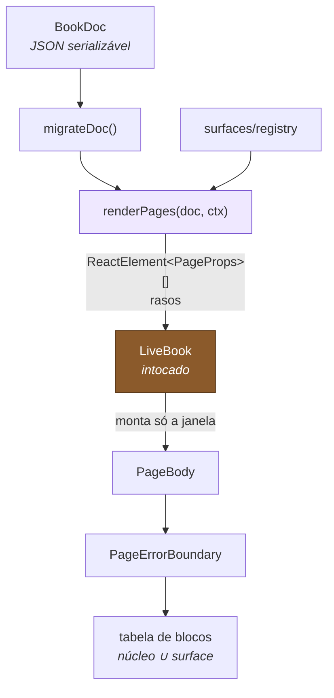

# Fase 1 — Design

**Spec**: `.specs/features/fase-1-documento-renderer/spec.md`
**Status**: Draft

---

## Contexto carregado

Decisões ativas em `.specs/STATE.md` que restringem este design: `AD-006` (surface é o
único eixo armazenado), `AD-008` e `AD-009` (renderer é função pura; motor não conhece
documento), `AD-010` (unidades tipadas), `AD-016` (teste deriva do critério de aceite),
`AD-022` (arquivos protegidos do motor).

**Nenhuma é superseded por este design.** Ele conforma a todas.

---

## Architecture Overview



O ponto que sustenta a virtualização: `renderPages` cria os elementos, mas **quem monta é
o motor**. `PageBody` só existe como elemento até a folha entrar na janela; a tabela de
blocos só é consultada quando o React efetivamente o renderiza.

---

## Exploração de abordagens

Três decisões de implementação tinham mais de um caminho viável. Todas entregam o mesmo
escopo.

### 1. Como `PageBody` recebe o contexto de render

| Opção | Prós | Contras |
|---|---|---|
| **A — `ctx` como parâmetro e prop** ✅ | `renderPages` testável como função pura, sem Provider; explícito | uma prop a mais em cada elemento |
| B — React Context com Provider fora do `LiveBook` | elementos ficam com props mínimas; idiomático | `renderPages` deixa de ser testável isoladamente — exigiria montar um Provider em todo teste |
| C — lookup por `surface` dentro do `PageBody` | zero threading | `PageBody` passaria a depender de estado de módulo, quebrando a pureza que `AD-008` exige |

**Escolhida: A.** O argumento decisivo é o teste: `AD-016` exige que os AC de `renderPages`
sejam verificáveis, e a opção B tornaria a função inseparável do React.

### 2. Isolamento de falha de bloco

Um `try/catch` em volta do dispatch **não funciona** — `<C block={b} />` só cria um
elemento; a exceção acontece quando o React renderiza o filho, fora do bloco `try`. Só
error boundary resolve.

| Opção | Prós | Contras |
|---|---|---|
| **A — boundary por página** ✅ | ~10 instâncias montadas; código mínimo | um bloco ruim apaga a página inteira |
| B — boundary por bloco | falha fica contida no bloco | 8–20 boundaries por página; mais código para um caso raro |
| C — sem boundary | nada a fazer | um bloco corrompido derruba o volume inteiro — viola DOC-06 |

**Escolhida: A.** Satisfaz o AC ("o volume DEVE continuar navegável") com o menor custo.
Migrar para B depois é local, e não muda contrato nenhum.

### 3. Onde vive a tabela de blocos

**Escolhida:** resolvida no registry e memoizada por `surface`, não por render. A tabela é
`núcleo ∪ surface.blocks` e só muda quando a surface muda — recalcular a cada página seria
desperdício em 300 páginas.

---

## Code Reuse Analysis

### Componentes existentes a aproveitar

| Componente | Local | Como usar |
|---|---|---|
| `Page` | `src/live-book/Page.tsx` | **emitir o componente real** — `surfaceOf` renderiza `{face.el}` dentro de `.lb-page__sheet` e o `.lb-page__body` vem do `Page`; um `<div>` equivalente não serve |
| `LiveBook` | `src/live-book/LiveBook.tsx` | consumir pelo barrel; só as props aditivas de DOC-10 |
| `units.ts` | `src/book/units.ts` (Fase 0) | conversões nos testes de sumário; nenhuma conversão nova aqui |
| `prose.css` | `src/live-book/prose.css` | **referência de estilo, não dependência** — os blocos ganham `bk-*` próprio; `prose.css` continua para conteúdo JSX manual |
| Custom properties `--lb-*` | `live-book.css:7-62` | os blocos consomem a paleta existente; nada de cor nova |
| `renderBook` helper | `src/live-book/__tests__/` (Fase 0) | testes de integração documento → motor |

### Pontos de integração

| Sistema | Método |
|---|---|
| Motor de virada | array de `ReactElement<PageProps>`; quatro props lidas por introspecção |
| Tema | custom properties inline no root do `LiveBook`, via prop `style` (DOC-10) |
| Suíte da Fase 0 | testes de caracterização rodam inalterados; são o gate de DOC-10 |

---

## Components

### `schema.ts`
- **Purpose**: definir o `BookDoc` e a união discriminada de blocos
- **Location**: `src/book/schema.ts`
- **Interfaces**: tipos apenas; `SCHEMA_VERSION` como constante
- **Dependencies**: nenhuma (não importa React nem nada do motor)
- **Reuses**: `PageTone` alinhado com `src/live-book/types.ts`

### `migrate.ts`
- **Purpose**: levar um documento de qualquer versão conhecida até a corrente
- **Location**: `src/book/migrate.ts`
- **Interfaces**: `migrateDoc(raw: unknown): { doc: BookDoc; readOnly: boolean }`
- **Dependencies**: `schema.ts`, registry (para `surface.migrate`)
- **Reuses**: —

> O retorno é um objeto, não o documento cru: `readOnly` é a única forma de o chamador
> saber que o documento veio de uma versão futura e não deve ser salvo.

### `renderPages.tsx`
- **Purpose**: traduzir documento em páginas do motor
- **Location**: `src/book/renderPages.tsx`
- **Interfaces**:
  - `renderPages(doc: BookDoc, ctx: RenderCtx): ReactElement<PageProps>[]`
  - `renderCover(spec: CoverSpec | undefined, ctx: RenderCtx): ReactNode`
- **Dependencies**: `Page` do motor, `PageBody`
- **Reuses**: `Page`

### `PageBody.tsx`
- **Purpose**: montar a árvore de blocos de uma página, só quando a folha monta
- **Location**: `src/book/PageBody.tsx`
- **Interfaces**: `PageBody({ page, index, ctx })`
- **Dependencies**: registry, `PageErrorBoundary`
- **Reuses**: —

### `surfaces/registry.ts`
- **Purpose**: registrar e resolver surfaces e suas tabelas de bloco
- **Location**: `src/book/surfaces/registry.ts`
- **Interfaces**: `registerSurface`, `getSurface`, `listSurfaces`, `blockTableFor(surfaceId)`
- **Dependencies**: `blocks/index.ts` (tabela de núcleo)
- **Reuses**: —

### `blocks/`
- **Purpose**: os oito renderers de núcleo
- **Location**: `src/book/blocks/` + `blocks.css`
- **Dependencies**: `RenderCtx` para `assetUrl`
- **Reuses**: custom properties `--lb-*`

---

## Data Models

O schema completo está em [ADR-001](../../../docs/adr/001-superficie-como-unico-eixo-de-variacao.md)
e no plano de arquitetura. Os pontos que este design fixa:

```ts
export interface RenderCtx {
  doc: BookDoc;
  surface: SurfaceDef;
  mode: "read" | "edit";
  /** Fase 1: identidade sobre caminho estático. Fase 2 troca pela do adapter. */
  assetUrl(ref: AssetRef, size?: AssetSize): string;
}

export interface SurfaceDef {
  id: SurfaceId;
  label: string;
  blocks?: Record<string, ComponentType<BlockRenderProps>>;
  layouts: { id: string; label: string; seed: () => Block[] }[];
  theme: BookTheme;
  defaultWindowRadius: number;
  chrome?: { hideNumbers?: boolean; margin?: "normal" | "tight" | "none" };
  migrate?(doc: BookDoc): BookDoc;
}
```

**Relações**: `BookDoc.surface` → `SurfaceDef.id`. `BookPage.layout` → id em
`SurfaceDef.layouts`; layout desconhecido cai no fluxo padrão.

---

## Error Handling Strategy

| Cenário | Tratamento | Impacto para o usuário |
|---|---|---|
| Bloco com `type` não registrado | `PageBody` pula; o bloco permanece no documento | nada aparece no lugar; resto da página normal |
| Bloco lança no render | `PageErrorBoundary` isola a página; log com `type` e `id` | a página fica em branco; o volume continua navegável |
| Surface não registrada | fallback com blocos de núcleo, sem tema | volume abre sem identidade visual, mas abre |
| `schemaVersion` ausente | `migrateDoc` lança | o chamador decide; na Fase 1 o documento vem de módulo, então é erro de programação |
| `schemaVersion` do futuro | devolve `readOnly: true` | volume abre travado para leitura |
| `layout` desconhecido | ignora e usa fluxo padrão | página renderiza em coluna |
| `AssetRef` sem `w`/`h` | imagem sem reserva de caixa | possível deslocamento de layout ao carregar |

---

## Risks & Concerns

| Concern | Local | Impacto | Mitigação |
|---|---|---|---|
| `surfaceCache` é memoizado por `faces`; qualquer mudança no documento reconstrói as ~10 superfícies montadas | [LiveBook.tsx:403](../../../src/live-book/LiveBook.tsx) | 8–20 ms por alteração; letal se acontecer a cada tecla | irrelevante nesta fase (documento estático); vira regra dura na Fase 4 — commit só em blur ou debounce |
| `angles` é memoizado por `leaves`; mudar a paridade recria todos os `MotionValue` e descarta animação em voo | [LiveBook.tsx:173](../../../src/live-book/LiveBook.tsx) | virada interrompida ao inserir página | fora do escopo desta fase; documentado para a Fase 5 |
| Handler de teclado só ignora `INPUT` e `TEXTAREA` | [LiveBook.tsx:298](../../../src/live-book/LiveBook.tsx) | seta vira a página enquanto se digita em `contentEditable` | **corrigido aqui** por DOC-10 AC 3 |
| Botões focáveis dentro de subárvore `aria-hidden` | [LiveBook.tsx:651](../../../src/live-book/LiveBook.tsx) | leitor de tela e navegação por Tab quebrados | fora do escopo; `AD-019` aloca para a Fase 2 |
| `App.tsx` importa `prose.css` diretamente | [App.tsx:2](../../../src/App.tsx) | acoplamento entre demo e kit de tipografia do motor | os blocos usam `bk-*` próprio; `prose.css` só permanece enquanto o demo tiver JSX manual |
| Sem cobertura de teste anterior a esta fase, exceto a Fase 0 | — | regressão silenciosa no motor | os testes de caracterização da Fase 0 são o gate de DOC-10 |
| `npm run shots` quebrado (`executablePath` de Linux) | `shot.mjs` | comparação visual do DOC-09 não roda | verificação visual do DOC-09 é manual nesta fase; conserto fica para a Fase 3, junto do Playwright |

---

## Tech Decisions

| Decisão | Escolha | Razão |
|---|---|---|
| Contexto de render | `ctx` explícito, não React Context | mantém `renderPages` testável como função pura |
| Isolamento de falha | error boundary por página | satisfaz o AC com ~10 instâncias em vez de ~200 |
| Tabela de blocos | memoizada por `surface`, não por render | evita recomputar em 300 páginas |
| Retorno de `migrateDoc` | `{ doc, readOnly }` | é a única forma de sinalizar documento de versão futura |
| CSS dos blocos | prefixo `bk-`, consumindo `--lb-*` | não duplica paleta e não colide com `prose.css` |
| Surface na Fase 1 | só `manuscript` | `album` sem pipeline de mídia seria projetada às cegas — ver spec |
| `text` renderiza HTML | sem sanitização nesta fase | conteúdo é do próprio autor e vem de módulo local; sanitização entra na Fase 2, quando o documento passa a vir da rede |

> **Nível de projeto:** a decisão de mover `album` para a Fase 3 altera o roadmap e deve
> ser registrada como `AD-023` em `.specs/STATE.md` ao aprovar este design. A decisão sobre
> sanitização também, porque cria uma obrigação para a Fase 2.
