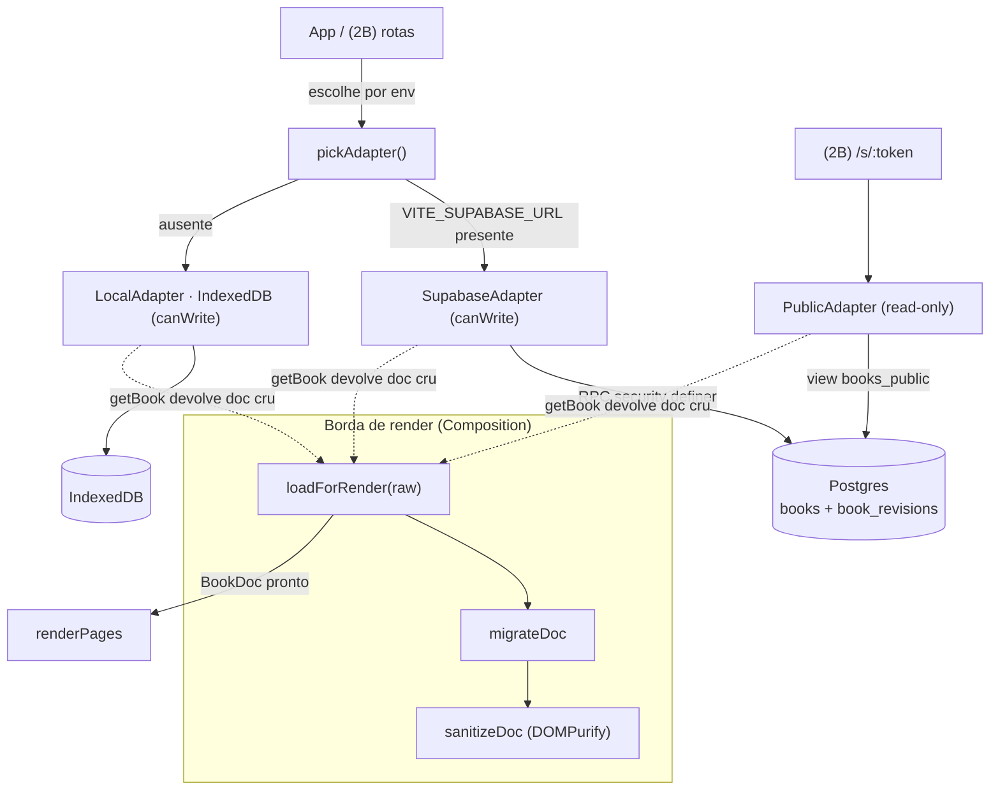

# Fase 2A — Persistência e acesso · Design

**Spec**: `.specs/features/fase-2a-persistencia/spec.md`
**Status**: Draft

> A macro-arquitetura desta fase **já foi decidida** em ADR-003 (JSONB único + histórico),
> ADR-004 (escrita anônima por `edit_token` via RPC `security definer`) e nos `AD-011/012/013/017/018`.
> Este design não reescolhe arquitetura: concretiza a **interface**, o **modelo de dados** e os
> **componentes**, e fixa as decisões locais que os ADRs deixaram em aberto.

## Decisões desta sessão (confirmadas com o autor)

- **Teto de revisões = 20** (resolve a *open question* da spec). ~3,6 MB de histórico por álbum
  de 300 págs; ~130 álbuns cheios cabem no plano free só de histórico. → `AD-025`.
- **Escopo de execução da 2A**: entrega a camada de dados + suíte de contrato + SQL + sanitizer.
  O `App.tsx` **continua no `demoDoc`**; a fiação de rotas/carregamento por adapter é da 2B.

---

## Architecture Overview

Três implementações da mesma interface `StorageAdapter`, escolhida em runtime por env var.
O adapter é a **única** coisa que o resto do produto conhece — ninguém importa `@supabase/supabase-js`
fora de `src/data/supabase/`.



**O ponto não óbvio (decisão de design):** a **sanitização não fica dentro do adapter**. O
adapter devolve o documento fielmente armazenado (contrato: "getBook devolve o documento salvo,
sem perda"). Migração + sanitização são um passo da borda de render — `loadForRender` — aplicado
por quem vai renderizar. Se sanitizássemos dentro de `getBook`, um documento que contém `<script>`
voltaria diferente do que foi salvo e o round-trip fiel do contrato quebraria. Sanitizar no
carregamento-para-render satisfaz `AD-024`/DATA-09 sem sujar a fidelidade do adapter. → `AD-026`.

---

## Code Reuse Analysis

### Existing Components to Leverage

| Componente | Local | Como usar |
|---|---|---|
| `BookDoc`, `Block`, `AssetRef`, `SurfaceId` | `src/book/schema.ts` | tipo de dado que o adapter persiste e devolve |
| `migrateDoc` | `src/book/migrate.ts` | passo 1 de `loadForRender`; já trata versão futura (`readOnly`) |
| `createEmptyDoc` | `src/book/factory.ts` | base para os documentos-fixture da suíte de contrato |
| `themeToVars` / `RenderCtx.assetUrl` | `src/book/schema.ts`, `RenderCtx.ts` | o `assetUrl` do adapter passa a alimentar o `ctx` (2B); assinatura já é síncrona |
| `demoDoc` | `src/demo/demoDoc.ts` | fixture rico (blocos variados + bloco desconhecido) para o teste de round-trip |

### Integration Points

| Sistema | Método de integração |
|---|---|
| Supabase (Postgres + Storage) | `@supabase/supabase-js` v2, **confinado** a `src/data/supabase/`; DDL executável em `schema.sql` |
| `RenderCtx` (Composition) | `assetUrl` do adapter injetado no `ctx` — só na 2B, quando o App carregar por adapter |
| `localStorage` | `editTokens.ts` guarda o `edit_token` por id de volume (`AD-017`) |

---

## Components

### `StorageAdapter` (a interface)
- **Purpose**: contrato único de persistência — o resto do produto só conhece isto (Open Host Service).
- **Location**: `src/data/StorageAdapter.ts`
- **Interfaces**: ver *Data Models* abaixo (métodos + tipos de retorno + erros).
- **Dependencies**: `src/book/schema.ts` (tipos). Nada de React, nada de motor.
- **Reuses**: `BookDoc`/`AssetRef`.

### `SupabaseAdapter`
- **Purpose**: implementação padrão sobre Postgres; escrita via RPC `security definer`.
- **Location**: `src/data/supabase/SupabaseAdapter.ts` (+ `client.ts`, `schema.sql`)
- **Interfaces**: `StorageAdapter`, `canWrite = true`.
  - `createBook(doc)` → RPC `create_book`; devolve `{ id, rev, editToken }` **uma vez**.
  - `saveBook(id, doc, rev)` → RPC `save_book` (checa token + `rev`, arquiva, poda 20).
  - `getBook(id)` → view `books_public`; devolve doc cru + `rev`.
  - `deleteBook`, `listBooks` (só colunas de sumário), `listRevisions`, `restoreRevision`, `gcAssets`.
  - `assetUrl(ref, size)` → string síncrona: `${url}/storage/v1/object/public/book-assets/${ref.id}` (`AD-013`).
- **Dependencies**: `client.ts` (singleton do SDK), env `VITE_SUPABASE_URL` / `VITE_SUPABASE_ANON_KEY`.
- **Reuses**: nenhum SDK vaza para fora deste diretório.

### `LocalAdapter`
- **Purpose**: dev offline e prova de que a interface não vazou detalhe de Postgres — escrito **junto**, não depois.
- **Location**: `src/data/local/LocalAdapter.ts`
- **Interfaces**: `StorageAdapter`, `canWrite = true`. Mesma semântica de `rev`/conflito/histórico, sobre IndexedDB (`idb`). `assetUrl` devolve `ref.id` por identidade (resolução real de blob é da Fase 3).
- **Dependencies**: `idb`; nos testes, `fake-indexeddb`.

### `PublicAdapter`
- **Purpose**: leitura pública para `/s/:token` (2B); **recusa toda escrita**.
- **Location**: `src/data/public/PublicAdapter.ts`
- **Interfaces**: `StorageAdapter`, `canWrite = false`. Métodos de leitura via `books_public`; qualquer escrita rejeita com `WriteForbiddenError`.

### `loadForRender`
- **Purpose**: borda de carregamento — transforma doc cru do adapter em doc pronto para render.
- **Location**: `src/book/loadDoc.ts`
- **Interfaces**: `loadForRender(raw: unknown): { doc: BookDoc; readOnly: boolean }` = `migrateDoc` → `sanitizeDoc`.
- **Reuses**: `migrateDoc`, `sanitizeDoc`.

### `sanitizeDoc`
- **Purpose**: remove script/atributos de evento do HTML autoral antes do render (DATA-09, `AD-024`).
- **Location**: `src/book/sanitize.ts`
- **Interfaces**: `sanitizeDoc(doc): BookDoc` — percorre blocos `text`/`callout`, passa `html` por DOMPurify com allowlist de formatação; preserva blocos desconhecidos intactos.
- **Dependencies**: `dompurify`.

### `editTokens`
- **Purpose**: guardar/recuperar o `edit_token` por volume, com link de resgate (`AD-017`).
- **Location**: `src/data/editTokens.ts`
- **Interfaces**: `getEditToken(id)`, `setEditToken(id, token)`, `clearEditToken(id)`, `encodeRescue(id, token)` / `decodeRescue(hash)`. Token viaja no **fragmento** da URL de resgate, nunca em query string.
- **Edge**: `localStorage` indisponível → lança erro explícito (não falha em silêncio).

### `limits` + `pickAdapter`
- **Location**: `src/config/limits.ts` (`MAX_PAGES=400`, `MAX_DOC_BYTES=4*1024*1024`, `REVISION_CAP=20`), `src/data/index.ts` (`pickAdapter()` decide por env).

---

## Data Models

### Interface TypeScript

```typescript
export type AdapterName = "supabase" | "local" | "public";

export interface BookSummary {          // o que a estante carrega — nunca BookDoc (invariante 6)
  id: string;
  title: string;
  subtitle?: string;
  surface: SurfaceId;
  pageCount: number;
  rev: number;
  visibility: "private" | "link";
  updatedAt: string;                    // ISO 8601
  cover?: AssetRef;                     // miniatura da estante
}

export interface CreateResult { id: string; rev: number; editToken: string }
export interface SaveResult   { rev: number }
export interface LoadedBook   { doc: BookDoc; rev: number }
export interface RevisionMeta { id: string; rev: number; createdAt: string }

export interface StorageAdapter {
  readonly name: AdapterName;
  readonly canWrite: boolean;

  createBook(doc: BookDoc): Promise<CreateResult>;                 // escrita
  getBook(id: string): Promise<LoadedBook | null>;                // leitura; doc CRU (sem sanitizar)
  saveBook(id: string, doc: BookDoc, rev: number): Promise<SaveResult>; // escrita; conflito por rev
  deleteBook(id: string): Promise<void>;                          // escrita
  listBooks(): Promise<BookSummary[]>;                            // leitura (estante — 2B)
  listRevisions(id: string): Promise<RevisionMeta[]>;             // leitura
  restoreRevision(id: string, revisionId: string): Promise<SaveResult>; // escrita; gera nova revisão
  gcAssets(id: string): Promise<void>;                            // escrita; preserva assets em uso
  assetUrl(ref: AssetRef, size?: AssetSize): string;              // SÍNCRONA (invariante 5)
}

export class RevConflictError   extends Error {}  // save com rev divergente
export class NotFoundError      extends Error {}  // volume apagado/inexistente
export class TooLargeError      extends Error {}  // > 4 MB ou > 400 páginas
export class WriteForbiddenError extends Error {} // escrita em adapter read-only
export class StorageUnavailableError extends Error {} // projeto pausado / rede — UI mostra carregando
```

### Postgres (`src/data/supabase/schema.sql`)

```
books
  id            uuid pk default gen_random_uuid()
  doc           jsonb not null
  rev           int   not null default 1
  -- colunas de sumário, escritas SÓ dentro das RPCs a partir do doc (fonte única):
  title         text  not null
  subtitle      text
  surface       text  not null
  page_count    int   not null default 0
  cover         jsonb                       -- AssetRef da capa, para a estante
  visibility    text  not null default 'link' check (visibility in ('private','link'))
  edit_token    text  not null default gen_random_uuid()   -- NUNCA sai por select público
  owner_id      uuid                        -- gancho inerte de Identity (AD-004)
  created_at    timestamptz not null default now()
  updated_at    timestamptz not null default now()

book_revisions  (append-only)
  id         uuid pk default gen_random_uuid()
  book_id    uuid not null references books(id) on delete cascade
  doc        jsonb not null
  rev        int   not null              -- o rev que está sendo arquivado
  created_at timestamptz not null default now()
  index (book_id, created_at desc)

view books_public  =  select id, doc, rev, title, subtitle, surface,
                             page_count, cover, visibility, updated_at
                      from books where visibility = 'link'
  -- expõe tudo MENOS edit_token e owner_id; grant select to anon
```

**RPCs `security definer`** (todas com `set search_path = ''` e nomes schema-qualificados —
`security definer` sem `search_path` fixo é escalação de privilégio clássica):

| RPC | Autorização | Faz |
|---|---|---|
| `create_book(doc)` | — | valida limites; insere; devolve `id, rev, edit_token` uma vez |
| `save_book(book_id, edit_token, doc, base_rev)` | token + `base_rev = rev` (`select … for update`) | arquiva doc atual em `book_revisions`, **poda para 20 na mesma transação**, grava doc + colunas de sumário, `rev := rev + 1`; conflito → `raise exception 'rev_conflict'`; limites → `raise 'too_large'` |
| `restore_revision(book_id, edit_token, revision_id)` | token | carrega doc da revisão, aplica como novo `save` (arquiva atual, `rev+1`) |
| `delete_book(book_id, edit_token)` | token | remove volume e revisões (cascade) |
| `claim_book(book_id, edit_token)` | token | **inerte**: `owner_id := auth.uid()`; documentado como gancho dormente |

**RLS**: `books` e `book_revisions` com RLS ligada; `anon` **não** recebe insert/update/delete
nem select direto de `books` (edit_token não pode vazar). Escrita só pelas RPCs. `grant execute`
das RPCs a `anon`. As **seis operações proibidas** que `scripts/check-rls.mjs` deve ver falhar:
insert/update/delete de `anon` em `books`, e insert/update/delete de `anon` em `book_revisions`
(select de `edit_token` já é barrado por não haver policy de select na tabela para `anon`).

---

## Error Handling Strategy

| Cenário | Tratamento | Impacto no usuário |
|---|---|---|
| Save com `rev` divergente | `save_book` não altera nada; adapter lança `RevConflictError` | UI (2B/editor) avisa e **trava** o autosave; nunca sobrescreve |
| Volume apagado, link antigo aberto | `getBook` → `null` | "não encontrado", não erro genérico |
| Documento > 4 MB ou > 400 págs | `save_book` recusa; adapter lança `TooLargeError` | mensagem acionável |
| Escrita em `PublicAdapter` | rejeita imediatamente com `WriteForbiddenError` | nenhum cromo de edição no DOM (`canWrite=false`) |
| Projeto Supabase pausado / rede fora | adapter sinaliza `StorageUnavailableError` (ou estado de carregando) | UI mostra **carregando**, não erro |
| `localStorage` indisponível | `editTokens` lança erro explícito | edição recusada com explicação |
| `schemaVersion` futura | `migrateDoc` devolve `readOnly=true` | abre em somente-leitura; save desabilitado |

---

## Risks & Concerns

| Concern | Local | Impacto | Mitigação |
|---|---|---|---|
| **Dívida `AD-024` não fica ligada na 2A** — App segue no `demoDoc`, então `sanitizeDoc` é entregue e testado mas não wired num carregamento de rede | `src/book/sanitize.ts`, `loadDoc.ts` | se a 2B esquecer de chamar `loadForRender`, doc da rede vai ao render sem sanitizar = XSS armazenado | `sanitizeDoc` + `loadForRender` entregues **e** cobertos por teste unitário na 2A; entrada obrigatória da 2B já registrada na spec; `loadForRender` é o único caminho documentado de carga |
| **`security definer` com `search_path` frouxo** | `schema.sql` (RPCs) | escalonamento de privilégio | template de RPC com `set search_path = ''` + nomes schema-qualificados; coberto por `check-rls.mjs` |
| **Duas fontes de verdade p/ tamanho** (`page_count` vs `jsonb_array_length(doc->'pages')`) | `books.page_count` | contagem divergindo do doc | `page_count`/`title`/`surface`/`cover` escritos **só** dentro de `create_book`/`save_book`, a partir do doc, na mesma transação |
| **Contrato do `LocalAdapter` em jsdom** | `src/data/local`, testes | IndexedDB não existe em jsdom | dep de teste `fake-indexeddb` importada no `src/test/setup.ts` |
| **`gcAssets` sem pipeline de upload** | `gcAssets` | coleta de órfãos ainda não tem arquivos reais (uploads são Fase 3) | contrato honrado (preserva refs do doc atual); efeito prático amadurece na Fase 3 |

---

## Tech Decisions (não óbvias)

| Decisão | Escolha | Racional |
|---|---|---|
| Onde sanitizar | borda de render (`loadForRender`), **não** no adapter | preserva a fidelidade de round-trip do contrato; satisfaz `AD-024` no carregamento → `AD-026` |
| Sanitizador | `dompurify` | padrão de mercado; roda em jsdom; strip de `on*` por default |
| Backing do `LocalAdapter` | IndexedDB via `idb` (+ `fake-indexeddb` nos testes) | `localStorage` (5 MB) estoura com doc + histórico; docs de arquitetura já preveem IndexedDB |
| Token de resgate na URL | **fragmento** (`#t=…`), nunca query string | fragmento não vai ao servidor nem entra em log; regra de privacidade |
| `assetUrl` local/público | identidade (`ref.id`) na 2A | uploads são Fase 3; construção real de URL de blob entra lá |
| Teto de revisões | 20, em `config/limits.ts`, espelhado no SQL | confirmado com o autor → `AD-025` |

> **Decisões de nível de projeto** promovidas a `AD-NNN` em `.specs/STATE.md`: `AD-025` (teto = 20),
> `AD-026` (sanitização na borda de render).

---

## Requirement Traceability (design → componentes)

| ID | Requisito | Componentes |
|---|---|---|
| DATA-01 | Contrato de armazenamento | `StorageAdapter.ts`, `adapter.contract.ts` |
| DATA-02 | Round-trip fiel (inclui bloco desconhecido) | `getBook`/`saveBook` dos 3 adapters; fixture `demoDoc` |
| DATA-03 | Adapter local e público | `LocalAdapter`, `PublicAdapter` (`canWrite=false`) |
| DATA-04 | Autorização por token e RPC | `create_book`/`save_book`, `editTokens.ts` |
| DATA-05 | RLS e view pública | `schema.sql` (RLS + `books_public`), `check-rls.mjs` |
| DATA-06 | Link de resgate | `editTokens.encodeRescue/decodeRescue` |
| DATA-07 | Histórico de revisões (poda 20, restaurar) | `book_revisions`, `save_book`, `restore_revision`, `listRevisions` |
| DATA-08 | Concorrência por `rev` | `save_book` (`for update`), `RevConflictError` |
| DATA-09 | Sanitização de HTML | `sanitize.ts`, `loadForRender` |

---

## Success Criteria (do design)

- [ ] A mesma `adapter.contract.ts` passa em Supabase, Local e Public (nos casos do seu `canWrite`)
- [ ] `check-rls.mjs` vê as seis operações proibidas falharem
- [ ] Criar → recarregar → abrir → apagar ponta a ponta
- [ ] Restaurar revisão devolve o conteúdo exato e gera nova revisão
- [ ] Nenhum `import` de `@supabase/supabase-js` fora de `src/data/supabase/`
- [ ] `assetUrl` síncrona nos três adapters
