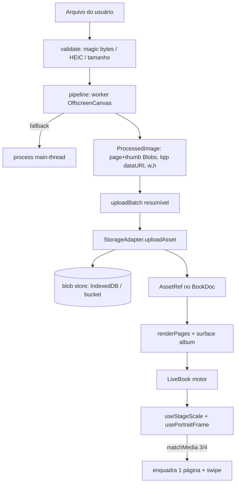

# Fase 3 — Imagens, surface `album` e modo retrato — Design

**Spec**: `.specs/features/fase-3-imagens-retrato/spec.md`
**Status**: Approved

> A spec fecha as duas *open questions* do retrato no papel (defaults adotados), com a
> validação em celular real diferida para **gate de aceite no fim do Execute** (decisão do
> autor, 2026-08-05). Sequência: fase inteira de uma vez.

---

## Architecture Overview

Quatro frentes independentes que se encontram em dois pontos já existentes do código
(`AssetRef` no schema e `StorageAdapter`). Nenhuma delas reescreve o motor: a virada 3D,
`faces`, `angles`, `surfaceOf` e `surfaceCache` (`AD-022`) permanecem intocados.



**As quatro frentes → user stories:**

| Frente | Stories | Requisitos |
|---|---|---|
| Pipeline de mídia (worker) | P1 pipeline | MEDIA-01/02/03 |
| Upload no contrato do adapter | P1 pipeline (lote), ciclo de vida | MEDIA-03 (limites), dimensões implícitas |
| Render sem estourar memória | P1 memória | MEDIA-04/05 |
| Surface `album` (tema, layouts, molduras) | P1 album | MEDIA-06/07 |
| Modo retrato (geometria) | P1 retrato | MEDIA-08/09/10 |
| Verificação de performance | P2 | MEDIA-11 |

---

## Abordagens consideradas (pontos que realmente ramificam)

### Decisão 1 — Onde mora o upload

- **A (escolhida): estender o contrato `StorageAdapter`** com `uploadAsset`. Os três adapters
  implementam, a suíte de contrato única (`adapter.contract.ts`) cobre os três, e o resto do
  produto continua conhecendo só a interface (Open Host Service). O 2A já deixou o gancho:
  `gcAssets` e `assetUrl` existem com comentário "uploads são Fase 3".
- B: um `UploadService`/módulo `ingest` que fala com storage por fora do adapter. Quebra o
  princípio "o resto do produto conhece SOMENTE o `StorageAdapter`" e duplica a fronteira de
  autorização. **Rejeitada.**

→ vira **AD-028**.

### Decisão 2 — Geometria do retrato (a parte de risco, `AD-005`)

- **A (escolhida): reenquadramento aditivo dentro do motor.** Um hook `usePortraitFrame`,
  disparado por `matchMedia("(max-aspect-ratio: 3/4)")`, faz três coisas aditivas: (1) põe
  `useStageScale` em modo "página única" (escala pela largura de UMA página, não do spread);
  (2) soma um **termo de enquadramento** ao `stageX` para centralizar a metade esquerda ou
  direita do spread; (3) instala handlers de swipe no viewport que alternam o lado e, no
  limite, chamam o `goTo` que já existe. `angles`, `faces`, `surfaceOf`, a virada — nada
  disso muda. É exatamente o "reusa `stageOffset`" que o `AD-005` previu.
- B: passar `portrait`/`frameSide` como props e mover o gesto para a rota. Empurra matemática
  de enquadramento para fora do motor e faz a rota conhecer geometria. **Rejeitada** —
  contraria `AD-009` (o enquadramento é preocupação do contexto Reading, não do produto).
- C: leitor vertical de uma página por vez. **Rejeitada pela spec** (a virada é o produto).

→ confirma e detalha o `AD-005`; vira **AD-029**.

### Decisão 3 — Endereçamento das variantes

Um `AssetRef.id` (uuid) endereça as três variantes por convenção de path:
`assetUrl(ref, size)` → `.../{ref.id}/{size}` (ex.: `…/{uuid}/page.webp`). O `lqip` **não**
é asset — vive embutido no doc como data URI (`AssetRef.lqip`, já no schema). Reenviar o
mesmo arquivo gera **novo uuid** (idempotência por identidade, não por conteúdo — spec);
`gcAssets` no save seguinte limpa o que saiu do doc.

---

## Code Reuse Analysis

### Existing Components to Leverage

| Componente | Local | Como usar |
|---|---|---|
| `AssetRef` (id/w/h/lqip), `AssetSize`, `ImageBlock`, `GalleryBlock` | `src/book/schema.ts` | Já modelam imagem — nada a mudar no schema |
| Bloco `Image` (box-reservation, lqip bg, `eager`) | `src/book/blocks/Image.tsx` | MEDIA-05 quase pronto; reusado pelos layouts do album |
| Bloco `Gallery` | `src/book/blocks/Gallery.tsx` | Base do layout `grid` |
| `StorageAdapter` + `adapter.contract.ts` | `src/data/` | Estender com `uploadAsset`; contrato cobre os 3 adapters |
| `gcAssets` (no-op na 2A) | `LocalAdapter.ts:180`, `SupabaseAdapter.ts:185` | Implementar coleta real de órfãos |
| `assetUrl(ref, size)` | 3 adapters | Passar a honrar `size` pela convenção de path |
| `useStageScale` + `stageOffset`/`stageX` | `src/live-book/useStageScale.ts`, `LiveBook.tsx:194` | Ponto de costura do retrato (`AD-005`) |
| `registerSurface` / `SurfaceDef` / `SurfaceLayout` | `src/book/surfaces/registry.ts`, `RenderCtx.ts` | `album` registra como `manuscript` fez — zero mudança no renderer (MEDIA-06 AC5) |
| Surface `manuscript` | `src/book/surfaces/manuscript/index.tsx` | Molde do `SurfaceDef` do album |
| `themeToVars` / custom props `--lb-*` | `schema.ts:200` | Tema do album sem CSS-in-JS (`AD-015`) |
| `limits.ts` (espelhado no SQL) | `src/config/limits.ts` | Adicionar `MAX_ASSET_BYTES = 2MB`, espelhar no `schema.sql` |

### Integration Points

| Sistema | Método de integração |
|---|---|
| `schema.sql` (Supabase) | Bucket `book-assets` já público (`AD-013`); adicionar RPC/policy de upload por `edit_token` e teto de 2 MB por objeto |
| `book_revisions` / `save_book` | `gcAssets` roda no caminho de save (ciclo de vida do asset) |
| `renderPages` | Layouts do album são blocos registrados na surface — a função pura não muda |

---

## Components

### 1. `validate` — porta de entrada de arquivo

- **Purpose**: aceitar `jpeg/png/webp/avif`, recusar HEIC por magic bytes e barrar >2 MB / >8000 px, sem quebrar o lote.
- **Location**: `src/media/validate.ts`
- **Interfaces**:
  - `sniffType(buf: ArrayBuffer): "jpeg" | "png" | "webp" | "avif" | "heic" | "unknown"` — por magic bytes, não por extensão
  - `validateFile(file: File): Promise<{ ok: true } | { ok: false; reason: RejectReason }>`
- **Dependencies**: nenhuma externa.
- **Reuses**: `MAX_ASSET_BYTES` de `limits.ts`.

### 2. `process` — decode → EXIF → resize → encode (puro)

- **Purpose**: produzir as variantes `page` (1100px, ≤200 KB) e `thumb` (320px), corrigindo orientação EXIF; lógica compartilhada por worker e fallback.
- **Location**: `src/media/process.ts`, `src/media/exif.ts`, `src/media/lqip.ts`
- **Interfaces**:
  - `processImage(bitmap: ImageBitmap, exifOrientation: number): Promise<{ page: Blob; thumb: Blob; w: number; h: number }>`
  - `readExifOrientation(buf: ArrayBuffer): number` — 1..8
  - `makeLqip(bitmap: ImageBitmap): Promise<string>` — 20px, data URI ≤1 KB
- **Dependencies**: `OffscreenCanvas`/`canvas` 2D + `createImageBitmap`; encode `image/webp` com qualidade ajustada até ≤200 KB.
- **Reuses**: nada — código novo, isolado e testável sem DOM (recebe `ImageBitmap`).

### 3. `pipeline` — orquestra worker + fallback

- **Purpose**: rodar `process` em worker (`OffscreenCanvas`), não bloqueando a main thread >50 ms/arquivo; cair para main-thread serial quando `OffscreenCanvas` não existe.
- **Location**: `src/media/pipeline.ts`, `src/media/worker.ts`
- **Interfaces**:
  - `processInPipeline(file: File): Promise<ProcessedImage>` — decide worker vs fallback
  - `ProcessedImage = { page: Blob; thumb: Blob; lqip: string; w: number; h: number }`
- **Dependencies**: Web Worker + `OffscreenCanvas`; feature-detect com fallback.
- **Reuses**: `process.ts` roda idêntico nos dois caminhos (mesma função, ambientes diferentes).

### 4. `uploadBatch` — lote resumível em pipeline

- **Purpose**: subir N arquivos processando N+1 enquanto sobe N, serial por arquivo, retomável; o doc registra o que já subiu (falha parcial não deixa página órfã).
- **Location**: `src/ingest/uploadBatch.ts`
- **Interfaces**:
  - `uploadBatch(files: File[], bookId: string, adapter: StorageAdapter, onProgress): Promise<BatchResult>`
  - `BatchResult = { uploaded: AssetRef[]; failed: { file: string; reason }[] }`
- **Dependencies**: `StorageAdapter.uploadAsset`.
- **Reuses**: pipeline de processamento; nenhuma página é escrita antes do upload confirmar (integridade de transição).

### 5. `StorageAdapter.uploadAsset` — extensão do contrato (AD-028)

- **Purpose**: subir as variantes de UM asset e devolver o `AssetRef` (id/w/h/lqip).
- **Location**: interface em `src/data/StorageAdapter.ts`; impl. nos 3 adapters.
- **Interfaces**:
  - `uploadAsset(bookId: string, img: ProcessedImage): Promise<AssetRef>` — gera uuid, sobe `page`+`thumb`, embute `lqip` no ref
  - `assetUrl(ref, size)` passa a honrar `size` pela convenção `.../{ref.id}/{size}`
- **Impl. por adapter**:
  - **Local**: blobs em IndexedDB por `{id}/{size}`; `assetUrl` devolve object URL cacheado (síncrono — invariante 5); `gcAssets` apaga blobs fora do doc
  - **Supabase**: `PUT` no bucket `book-assets/{bookId}/{id}/{size}.webp`; autorização por `edit_token` (`AD-012`), teto 2 MB; `gcAssets` lista e remove órfãos
  - **Public**: lança `WriteForbiddenError` (somente leitura)
- **Reuses**: `adapter.contract.ts` ganha o bloco de upload/round-trip/gc, roda nos 3.

### 6. Surface `album`

- **Purpose**: apresentação de fotos — tema próprio, margens estreitas, `defaultWindowRadius = 2`, layouts e molduras.
- **Location**: `src/book/surfaces/album/index.tsx`, `album.css`, blocos de layout em `src/book/surfaces/album/blocks/`
- **Interfaces (SurfaceDef)**:
  - `theme`: paleta de álbum; `chrome: { margin: "tight" }`; `defaultWindowRadius: 2`
  - `layouts`: `full-bleed`, `single`, `duo`, `grid`, `photo-text`, `text` (cada um com `seed()`)
  - `blocks`: renderers exclusivos onde o núcleo não basta (ex.: `full-bleed` sangra e suprime número via `hideNumber`)
  - **molduras** (`plain` | `polaroid` | `bleed` | `circle`): prop de moldura aplicada ao redor da imagem, resultados visualmente distintos (MEDIA-07 AC4); proporção extrema é contida sem distorcer
- **Dependencies**: `registerSurface`, blocos `Image`/`Gallery` do núcleo.
- **Reuses**: molde do `manuscript`; MEDIA-06 AC5 — registrar não altera arquivo existente.

### 7. `usePortraitFrame` + escala de página única (retrato, AD-005/AD-029)

- **Purpose**: no celular em pé, enquadrar uma página legível (≥320px em 390px) mantendo a virada; swipe alterna o lado do spread e, no limite, vira a folha.
- **Location**: `src/live-book/usePortraitFrame.ts`; alterações aditivas em `useStageScale.ts` e no cálculo de `stageX` em `LiveBook.tsx` (escopo do `AD-005`).
- **Interfaces**:
  - `useStageScale(ref, { portrait })` — em retrato, `fit` usa a largura de UMA página (`PAGE_W + 2·BOARD_SQUARE`), garantindo ≥320px em 390×844
  - `usePortraitFrame(...)` → `{ portrait: boolean; frameSide: "left" | "right"; onSwipe }`; soma um termo de enquadramento ao `stageX`; ao passar do limite chama o `goTo` existente e reposiciona o lado
  - gatilho: `matchMedia("(max-aspect-ratio: 3/4)")`; desligar volta ao desktop sem recarregar (MEDIA-10 AC5/AC7)
- **Dependencies**: `matchMedia`, `stageX` (MotionValue já existente), `goTo` (API já existente).
- **Reuses**: `stageOffset`/`stageX`, `useStageScale`, `goTo`. **Não** toca `angles`, `faces`, `surfaceOf`, `surfaceCache`, `inWindow`, `toc` nem a geometria de `live-book.css`.

### 8. Verificação de performance (MEDIA-11)

- **Purpose**: transformar as metas de FPS e faces montadas em asserção de máquina.
- **Location**: `e2e/perf.spec.ts`; correção de `scripts/shot.mjs`
- **Interfaces**:
  - e2e mede FPS ao folhear 20 páginas com foto sob throttle 4× → falha <30
  - conta faces montadas com `windowRadius=2` → falha >10
  - `shot.mjs` resolve o browser pelo próprio Playwright (sem `executablePath` fixo)
- **Dependencies**: Playwright (já referido em `shot.mjs`).
- **Reuses**: caracterização da Fase 0 permanece o gate estrutural (MEDIA-10 AC6).

---

## Data Models

`AssetRef` **já existe** e não muda (`schema.ts:30`). Modelos novos são de processo (fora do doc):

```typescript
// src/media/pipeline.ts — nunca serializado no doc
interface ProcessedImage {
  page: Blob;      // 1100px maior lado, webp, <=200 KB
  thumb: Blob;     // 320px
  lqip: string;    // data URI <=1 KB — vai para AssetRef.lqip
  w: number;       // largura intrínseca já corrigida por EXIF
  h: number;
}

type RejectReason = "heic" | "not-an-image" | "too-large" | "too-many-pixels";
```

**Relação**: `uploadAsset` consome `ProcessedImage`, persiste `page`+`thumb`, e devolve o
`AssetRef` (`{ id, w, h, lqip }`) que o bloco `image`/`gallery` guarda no `BookDoc`.

---

## Error Handling Strategy

| Cenário | Tratamento | Impacto no usuário |
|---|---|---|
| HEIC escolhido | recusado por magic bytes | mensagem "exporte como JPEG"; lote segue |
| Arquivo não-imagem apesar da extensão | recusado por `sniffType` | pulado, lote não quebra |
| Imagem >8000 px | reamostra ou recusa com mensagem | nunca trava |
| `page` não fecha em ≤200 KB | reduz qualidade webp em passos até caber | imagem um pouco mais leve |
| `OffscreenCanvas` ausente | fallback main-thread serial | processa mais devagar, um por vez |
| Upload falha no meio do lote | já enviados permanecem; fila retomável | botão "retomar"; nenhuma página órfã |
| Escrita em `PublicAdapter` | `WriteForbiddenError` | UI de leitura não expõe upload |
| Imagem removida do doc | `gcAssets` coleta no save seguinte | armazenamento não vaza |

---

## Risks & Concerns

| Concern | Location | Impact | Mitigation |
|---|---|---|---|
| Retrato mexe na única geometria do motor otimizado | `useStageScale.ts`, `LiveBook.tsx:194` (`stageX`) | regressão de FPS/virada cara de diagnosticar | Mudança **estritamente aditiva** (escala de página única + termo de framing); virada/`angles`/`faces` intactos; caracterização da Fase 0 é o gate (MEDIA-10 AC6); validação em celular real como gate final |
| `assetUrl` deve continuar **síncrona** com blobs locais | `LocalAdapter.ts:188` (invariante 5, `AD-013`) | Promise no caminho de render quebra `surfaceCache` | Object URLs pré-criados e cacheados no upload/carga; `assetUrl` só lê o cache |
| VRAM de textura pode derrubar a máquina alvo | `AD-014` | trava em máquina fraca / 4K | `windowRadius=2` (≤10 faces), variante `page` 1100px ≤200 KB; asserção e2e (MEDIA-11) |
| Encode webp de 12 MP na main thread trava ~400 ms | pipeline | UI congela num drop de pasta | worker `OffscreenCanvas`; fallback serial só quando indisponível |
| `gcAssets` agressivo apaga asset ainda referenciado por revisão | `save_book`/`book_revisions` | perda de imagem de versão restaurável | gc preserva o que qualquer revisão retida referencia, não só o doc atual — **confirmar no design de tasks** |
| HTML de `text`/`callout` do album vindo da rede | `sanitize.ts` (`AD-024/026`) | XSS se o album pular `loadForRender` | já coberto: caminho de carga sanitiza; album não introduz bloco de HTML novo |

---

## Tech Decisions (não óbvias)

| Decisão | Escolha | Racional |
|---|---|---|
| Upload no contrato do adapter | `uploadAsset` na `StorageAdapter`, 3 impls + contrato | Open Host Service; 2A já deixou `gcAssets`/`assetUrl` prontos → **AD-028** |
| Geometria do retrato | reenquadramento aditivo (escala 1 página + framing em `stageX` + swipe) | `AD-005` já previu "reusa `stageOffset`"; virada intacta → **AD-029** |
| Endereço das variantes | 1 uuid + convenção `.../{id}/{size}`; `lqip` inline no doc | `assetUrl` síncrona; doc guarda só referência (~180 KB/álbum, `AD-011`) |
| Idempotência de upload | novo uuid por envio (identidade, não hash de conteúdo) | dimensão implícita da spec; `gcAssets` limpa órfãos |
| Formato de saída | `image/webp` | melhor razão peso/qualidade para caber ≤200 KB; alvo aceita webp |
| Gatilho retrato | `matchMedia("(max-aspect-ratio: 3/4)")` | separa celular em pé de tablet/desktop; **validar em device** |

> **Project-level:** AD-028 (upload no contrato) e AD-029 (geometria do retrato) serão
> anexados a `.specs/STATE.md` na aprovação deste design. AD-029 confirma e detalha AD-005.
