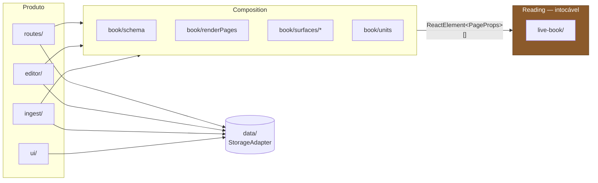
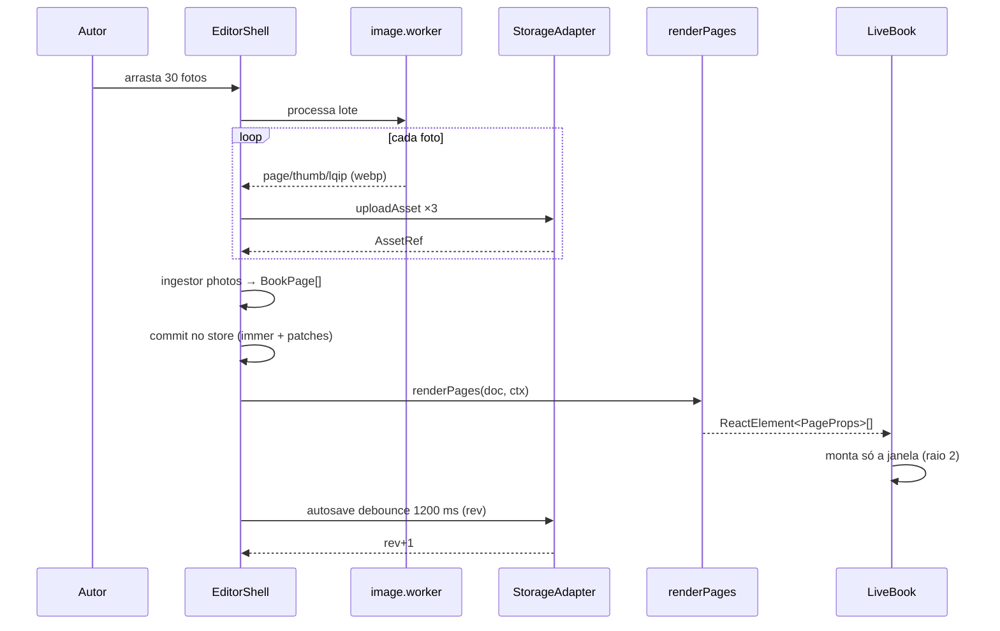

# Arquitetura

Como o Live Book é organizado, quais são as fronteiras e o que acontece quando elas
são rompidas.

Decisões individuais e seus trade-offs estão nos [ADRs](../adr/). Este documento é o
mapa: como as peças se encaixam.

---

## Princípio organizador

O motor de virada é um componente reutilizável que **não sabe que existe um produto em
volta dele**. Tudo o mais é o produto. A arquitetura inteira existe para manter essa
frase verdadeira enquanto o produto cresce.



Note o que **não** existe no diagrama: nenhuma seta chegando em `live-book/` que não
seja o array de elementos. Nenhuma seta saindo dele.

---

## Estrutura de diretórios alvo

```
src/
├── live-book/            ← Reading. INTOCÁVEL (ADR-002, AD-022)
│   ├── LiveBook.tsx           motor; só recebe children e props de chassi
│   ├── Leaf.tsx  Page.tsx  types.ts  constants.ts
│   ├── useStageScale.ts  usePageSound.ts
│   └── live-book.css  prose.css
│
├── book/                 ← Composition
│   ├── schema.ts              BookDoc, Block, BookPage, SCHEMA_VERSION
│   ├── units.ts               FaceIndex/LeafIndex/PageNumber + conversões (ADR-006)
│   ├── migrate.ts             migrateDoc, cadeia de MIGRATIONS
│   ├── factory.ts             createEmptyDoc, createPage, createBlock
│   ├── renderPages.tsx        doc → ReactElement<PageProps>[] (ADR-002)
│   ├── PageBody.tsx           dispatch de blocos; monta só quando a folha monta
│   ├── RenderCtx.tsx          { doc, mode, assetUrl, surface }
│   ├── blocks/                renderers dos blocos de núcleo + blocks.css
│   └── surfaces/              registry + album/ + manuscript/
│
├── ingest/               ← Ingestion
│   ├── registry.ts            catálogo de ingestores
│   ├── photos/                lote de imagens → BookPage[]
│   └── blank/                 páginas vazias
│
├── media/                ← pipeline de imagem (ADR-005)
│   ├── imageProcess.ts  image.worker.ts  assetCache.ts  useAssetPrefetch.ts
│
├── data/                 ← Storage
│   ├── StorageAdapter.ts      a interface; a única coisa que o resto conhece
│   ├── supabase/              client, adapter, schema.sql
│   ├── local/                 IndexedDB — escrito JUNTO, não depois
│   └── public/                somente leitura, para /s/:token
│
├── routes/               ← Library + Access
├── editor/               ← autoria
├── ui/                   ← componentes compartilhados + design system
└── config/               limits.ts, flags.ts
```

---

## O contrato entre motor e documento

Este é o ponto onde o projeto vive ou morre.

**O que o motor lê dos filhos** — e é literalmente tudo:

| Prop | Uso no motor |
|---|---|
| `chapter` | vira item do sumário, tick de progresso e fita lateral |
| `title` | rótulo no sumário e no marcador de leitura |
| `tone` | classe estética da folha |
| `hideNumber` | suprime a numeração no rodapé |

**O que `renderPages` entrega:** um array de `<Page>` rasos. Dois `createElement` por
página, sem árvore de blocos. A árvore só nasce quando o React monta o `<PageBody>` —
ou seja, quando a folha entra na janela de virtualização.

```
doc.pages: 300 itens
  → renderPages: 600 createElement rasos       (~0 ms)
  → faces: 604 descritores                     (motor)
  → montados: ~10 faces                        (janela, raio 2)
  → PageBody montados: ~10                     (árvore de blocos só aqui)
```

**Mudanças permitidas no motor** (aditivas, todas default-off):
`style`, `toolbar`, `wheelFlip`, `apiRef`, guarda de `contentEditable` no teclado, e o
reenquadramento de retrato via `stageOffset` (ADR-005 de produto, `AD-005`).

**Mudanças proibidas:** `Face`, `surfaceOf`, `faces`, `toc`, `inWindow`, `surfaceCache`,
`angles`, `Leaf.tsx`, `constants.ts`, geometria de `live-book.css`.

---

## Registry de surfaces

Uma surface é o contrato de apresentação de um volume. Registra-se, não se edita nada.

```ts
export interface SurfaceDef {
  id: SurfaceId;                    // "album" | "manuscript" | ...
  label: string;
  blocks?: Record<string, ComponentType<BlockRenderProps>>;   // blocos exclusivos
  editors?: Record<string, ComponentType<BlockEditorProps>>;
  layouts: { id: string; label: string; seed: () => Block[] }[];
  theme: BookTheme;
  defaultWindowRadius: number;      // 2 quando há imagem (ADR-005)
  chrome?: { hideNumbers?: boolean; margin?: "normal" | "tight" | "none" };
  migrate?(doc: BookDoc): BookDoc;
}

registerSurface(def): void
getSurface(id): SurfaceDef          // desconhecida → fallback só com blocos de núcleo
listSurfaces(): SurfaceDef[]
```

Blocos de núcleo (`heading`, `text`, `image`, `gallery`, `quote`, `callout`, `rule`,
`spacer`) estão disponíveis para toda surface sem registro. Uma surface só declara o
que é exclusivo dela.

Adicionar `journal` no futuro: criar `surfaces/journal/`, chamar `registerSurface`,
somar `"journal"` à união. Nada mais é tocado.

---

## Ingestão

Ingestores produzem páginas; não renderizam e não navegam.

```ts
export interface Ingestor {
  id: IngestorId;                   // "photos" | "pdf" | "blank"
  accept: string;
  label: string;
  run(input: File[] | void, io: IngestIO): Promise<IngestResult>;
}

export interface IngestIO {
  upload(blob: Blob, meta: AssetUploadMeta): Promise<AssetRef>;
  progress(done: number, total: number, note?: string): void;
  signal: AbortSignal;
}

export interface IngestResult {
  pages: BookPage[];
  record: IngestRecord;             // vira provenance no documento
  warnings?: string[];
}
```

Toda ingestão é assíncrona, cancelável e retomável — o documento guarda o que já subiu,
para que uma importação interrompida não recomece do zero.

**Presets** vivem só na UX de criação e não existem no schema:

| Preset | surface | ingestor |
|---|---|---|
| Álbum de fotos | `album` | `photos` |
| Livro escrito | `manuscript` | `blank` |
| *(futuro)* Diário | `journal` | `blank` |
| *(futuro)* Importar PDF | `scan` | `pdf` |

Combinações fora dos presets (`album` + `pdf`) são válidas por construção — só não têm
atalho na UI. Ver [ADR-001](../adr/001-superficie-como-unico-eixo-de-variacao.md).

---

## Camada de dados

Três implementações da mesma interface, desde o dia 1:

| Adapter | Quando | `canWrite` |
|---|---|---|
| `SupabaseAdapter` | padrão | sim |
| `LocalAdapter` | sem env vars; dev offline | sim |
| `PublicAdapter` | rota `/s/:token` | **não** |

Escrever o local **junto** com o remoto é o que prova que a interface não vazou detalhe
de Postgres. `canWrite = false` é o que faz a UI esconder edição sem espalhar `if`.

Modelagem, RLS e RPCs estão em [ADR-003](../adr/003-documento-como-jsonb-com-historico.md)
e [ADR-004](../adr/004-escrita-anonima-por-token-de-edicao.md); o DDL executável vive em
`src/data/supabase/schema.sql`.

---

## Rotas

```
/                      estante
/new                   escolha de preset → documento vazio → /b/:id/edit
/b/:bookId             leitor
/b/:bookId/p/:page     leitor no número impresso :page      ← canônica
/b/:bookId/c/:slug     capítulo → resolve → replace para /p/:page
/b/:bookId/edit        editor
/s/:shareToken         leitura pública, sem cromo de edição
```

**Conversão URL ↔ motor:** a URL fala em `PageNumber`, o motor em `LeafIndex`. A tradução
é responsabilidade de `book/units.ts` — nunca da rota, nunca do motor. É exatamente aqui
que o bug histórico volta se alguém tiver pressa ([ADR-006](../adr/006-unidades-de-paginacao-como-tipos-distintos.md)).

**Sempre `replace`.** Cada virada de página que empilhasse uma entrada de histórico
enterraria o botão voltar depois de quarenta páginas.

---

## Fluxo: montar um álbum



O ponto não óbvio: o upload acontece **durante** o processamento, não depois. Bufferizar
30 imagens processadas em memória antes de subir é o que quebra a máquina alvo.

---

## Invariantes

Se alguma destas for falsa, a arquitetura foi rompida. Estão escritas em `CLAUDE.md`
para valerem em toda sessão.

1. `src/live-book/` não importa nada de `src/book/`, `src/data/`, `src/routes/` ou `src/editor/`
2. Não existe `if (surface === …)` dentro de `src/live-book/`
3. `renderPages` é pura: sem I/O, sem hooks, sem estado de módulo
4. Nenhuma conversão entre face, folha e número impresso fora de `src/book/units.ts`
5. `StorageAdapter.assetUrl` é síncrona
6. A estante carrega `BookSummary`, nunca `BookDoc`
7. Bloco de `type` desconhecido sobrevive ao round-trip de leitura e escrita
8. Todo save carrega `rev`; conflito nunca vira sobrescrita silenciosa

---

## Riscos arquiteturais conhecidos

| Risco | Onde | Mitigação |
|---|---|---|
| Tema vazando conceito para o motor | borda `renderPages`/`LiveBook` | tema vira custom properties inline; o motor recebe cores |
| Editor invalidando `surfaceCache` a cada tecla | `useMemo(…, [faces])` | commit só em blur ou debounce 600 ms; `key`s estáveis fazem o React reconciliar |
| `angles` recriado ao mudar a paridade de folhas | `useMemo(…, [leaves])` | inserir páginas só no fim, e bloquear inserção durante virada |
| Ingestão travando a UI | worker de imagem/PDF | processamento serial em worker, com progresso e cancelamento |
| Documento crescendo além de 1 MB | surface `scan` | gatilho e caminho de migração definidos no ADR-003 |
| Conversão de unidade errada | 5 pontos novos | branded types (ADR-006) + testes em `units.ts` |
