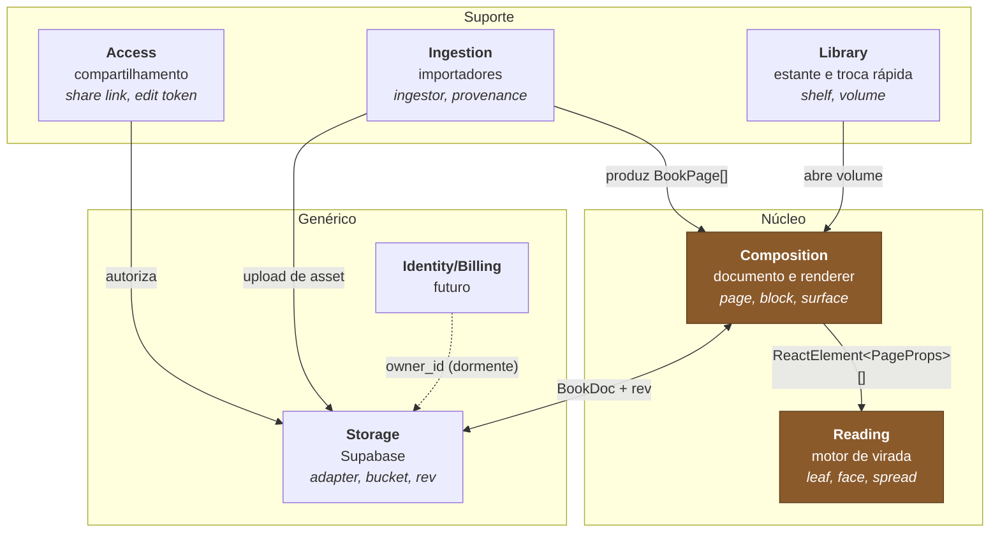

# Mapa de contextos

Análise estratégica: quais domínios existem, qual é o núcleo, e onde as fronteiras
precisam ser defendidas.

## Visão geral

A seta que importa é a de cima, e ela é **de mão única**: Composition produz elementos
para Reading. Reading nunca olha para trás.

---

## Reading — Core

**Capacidade:** transformar uma sequência de faces numa experiência de livro físico
que vira, com performance em máquina fraca.

**Linguagem:** folha, face, spread, virada, cascata, janela, assentar, palco, escala, alça.

**Por que é o núcleo:** é a vantagem competitiva. Qualquer um renderiza páginas; o
diferencial é a virada rodando a ~37 FPS com 300 páginas sob throttle 4x. É também o
código mais caro de reproduzir e o mais fácil de estragar.

**Fronteira — a regra mais importante do projeto:**
Reading **não conhece** documento, bloco, surface, ingestor, storage ou rota. Recebe
`children: ReactNode` e lê apenas quatro props dos filhos (`chapter`, `title`, `tone`,
`hideNumber`). Se algum dia um `if (surface === ...)` aparecer dentro de `src/live-book/`,
a fronteira foi rompida.

**Integração:** *Conformist* invertido — Composition se conforma ao formato que Reading
já espera (`ReactElement<PageProps>[]`). O motor não muda para acomodar o documento;
o documento é traduzido para o motor. Ver [AD-008](../../.specs/STATE.md) e [AD-009](../../.specs/STATE.md).

**Coesão:** 10/10. Vocabulário próprio, tudo muda junto, nada de fora vaza.

---

## Composition — Core

**Capacidade:** representar um volume como dado serializável e traduzi-lo em páginas
renderizáveis, com variação por surface.

**Linguagem:** documento, página, bloco, layout, surface, tom, capítulo, migração.

**Por que é núcleo:** é o que transforma o motor em produto. Sem ele o Live Book é um
componente de demonstração.

**Fronteira:** conhece Reading (produz para ele) mas não conhece Storage, rotas nem
editor. `renderPages` é pura: mesmo documento, mesma saída, sem I/O.

**Ponto de atenção:** é o contexto com maior risco de virar Big Ball of Mud, porque
tudo quer tocá-lo. A defesa é o registry de surfaces — nenhum consumidor adiciona
comportamento por `if`, só por registro.

**Coesão:** 9/10.

---

## Ingestion — Suporte

**Capacidade:** produzir `BookPage[]` a partir de fontes externas (lote de fotos,
PDF, entrada vazia).

**Linguagem:** ingestor, lote, provenance, progresso, retomada, asset.

**Por que suporte e não núcleo:** essencial ao produto, mas não é o diferencial —
importar PDF é problema conhecido, com biblioteca pronta.

**Fronteira:** produz páginas e devolve; nunca renderiza, nunca navega. Cada ingestor
é assíncrono, cancelável e retomável.

**Dependência de Storage:** direta e assumida — ingestor sobe assets enquanto processa.
É a única dependência cruzada aceita sem intermediação, porque o alternativo (bufferizar
200 páginas de raster em memória) mata a máquina alvo.

**Coesão:** 8/10.

---

## Library — Suporte

**Capacidade:** listar, criar, abrir, apagar e alternar entre volumes.

**Linguagem:** estante, volume, capa, troca rápida.

**Fronteira:** trabalha com `BookSummary` (metadados), **nunca** com `BookDoc` completo.
A estante não carrega documentos — carregar 40 documentos de 180 KB para desenhar 40
capas seria absurdo. Essa é a regra que mantém a home rápida.

**Coesão:** 8/10.

---

## Access — Suporte

**Capacidade:** decidir quem lê e quem escreve, sem login.

**Linguagem:** link de compartilhamento, token de edição, link de resgate, visibilidade, revisão.

**Por que é um contexto separado:** hoje parece um detalhe de duas colunas no banco.
Quando entrar autenticação, vira o ponto de tradução entre "anônimo com token" e
"usuário dono" — e é onde `claim_book` mora. Separar agora custa quase nada e evita
que a lógica se espalhe.

**Fronteira:** *Anti-corruption layer* para Identity. Quando Auth chegar, o resto do
sistema não deveria notar.

**Coesão:** 7/10 hoje (poucos conceitos), sobe quando Identity existir.

---

## Storage — Genérico

**Capacidade:** persistir documentos e arquivos.

**Linguagem:** adapter, bucket, path, rev, conflito.

**Por que genérico:** problema resolvido; o valor está em não nos prendermos. Por isso
a `StorageAdapter` é interface, com três implementações desde o dia 1 (Supabase, IndexedDB
local, público somente-leitura). Escrever a implementação local **junto** com a remota é
o que garante que a interface não vazou detalhe de Postgres.

**Integração:** *Open Host Service* — todo o resto fala com a interface, nunca com o
SDK do Supabase.

---

## Identity / Billing — Genérico, dormente

Não construído. Os ganchos existem e são inertes: `owner_id` nullable nas tabelas,
policies já escritas na forma `owner_id = auth.uid()`, e a RPC `claim_book` que
converte volumes anônimos em volumes de um usuário no primeiro login.

Sem `claim_book`, o dia do login vira migração manual de dados.

---

## Matriz de coesão cruzada

| A | B | Acoplamento | Situação |
|---|---|---|---|
| Reading | Composition | unidirecional, via `ReactElement<PageProps>[]` | ✅ é a fronteira defendida |
| Composition | Storage | via `StorageAdapter` | ✅ interface, sem SDK vazado |
| Ingestion | Storage | direta, para upload em pipeline | ⚠️ aceita conscientemente (memória) |
| Library | Composition | só `BookSummary` | ✅ nunca carrega documento inteiro |
| Access | Storage | via RPC | ✅ autorização no servidor |
| Reading | qualquer outro | **nenhum** | ✅ invariante do projeto |

---

## Riscos de fronteira

**1. Tema vazando para dentro do motor.**
Cada surface tem tema próprio, e a tentação é passar `surface` para o `LiveBook`.
Defesa: o tema vira custom properties `--lb-*` aplicadas inline no root; o motor
recebe cores, não conceitos.

**2. Editor querendo controlar o motor.**
O editor precisa navegar (ir para a página X), o que parece justificar acoplamento.
Defesa: um handle imperativo mínimo e explícito (`goTo`, `leaves`, `getLeaf`) — o editor
comanda, mas não sabe como o motor funciona.

**3. Rotas conhecendo faces.**
A URL usa número impresso; o motor usa folha. A conversão é responsabilidade de
Composition (`src/book/units.ts`), nunca da rota, nunca do motor. É onde o bug histórico
volta se alguém tiver pressa.
